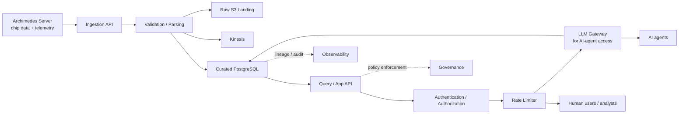

# Semiconductor Intelligence Platform (SIP)

A sovereign semiconductor intelligence platform for ingesting, governing, and analyzing manufacturing and engineering data. It combines metadata-driven ingestion, S3 lakehouse-style storage, PostgreSQL-backed intelligence, and AI-ready retrieval scaffolding.

## What this repository provides

- Multi-format ingestion for MES, ERP, equipment, PLM, telemetry, and yield payloads
- Metadata-driven validation and routing for new data sources
- S3-based raw landing and lakehouse-style asset cataloging
- Governance controls for IP-sensitive and restricted data
- Traceability links across lots, wafers, tools, and design versions
- AI/RAG-ready document indexing and search scaffolding

## Architecture at a glance

1. Source systems send events into the ingestion API.
2. The parser and validator normalize each payload and check it against schema rules.
3. Valid events are stored in S3 and published for downstream processing.
4. Curated records are persisted in PostgreSQL and linked to governance, traceability, and AI services.

### Secure AI and Human Consumption Reference Architecture

This reference view shows how Archimedes chip data and telemetry can be exposed securely to AI agents and human users after curation into PostgreSQL.



Notes:
- PostgreSQL remains the trusted curated data store for downstream consumption.
- Human users consume through the secured API layer.
- AI agents consume through the LLM gateway path when prompt governance, guardrails, and model routing are required.
- The rate limiter applies at the shared consumption edge to protect both human and agent-driven workloads.

## Quick start

```bash
git clone <this-repo>
cd Semiconductor_Operations_Data_Platform
docker compose up --build
```

Once the services are up, use the Swagger UI at `http://localhost:8000/docs` or call the ingestion endpoints directly.

## Key services

| Service | Purpose |
| --- | --- |
| FastAPI ingestion API | Accepts and routes new events |
| S3 landing zone | Stores raw payloads for lakehouse workflows |
| PostgreSQL | Stores curated records and audit information |
| Governance and AI layers | Applies policy rules and supports retrieval-based intelligence |

## Test and validation

```powershell
./scripts/run_pytest.ps1 -q tests/test_api.py -k "validation_ui"
```

The repository includes sample payloads and smoke-test flows for telemetry, yield, and core ingestion paths.

## Project owner

ravikanth.kowdeed@gmail.com
