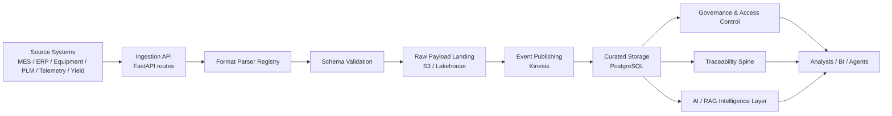
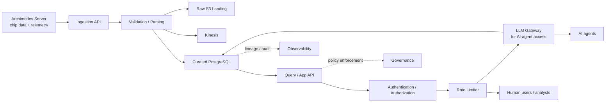
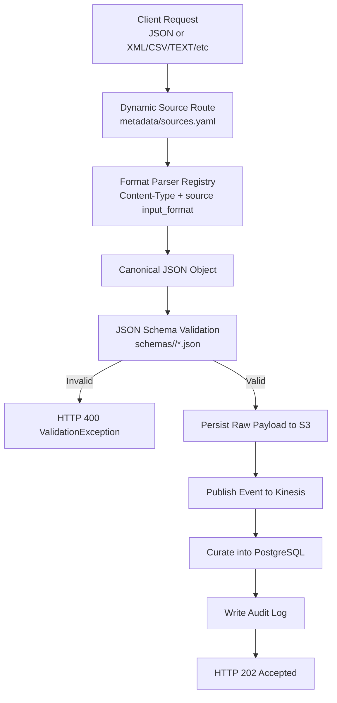
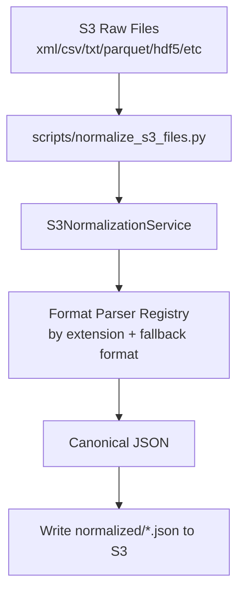
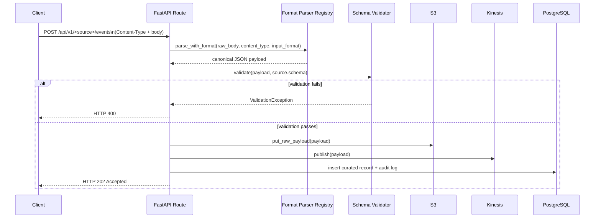

# Semiconductor Intelligence Platform (SIP)

A sovereign semiconductor intelligence platform for ingesting, governing, and analyzing manufacturing and engineering data. It combines metadata-driven ingestion, S3 lakehouse-style storage, PostgreSQL-backed intelligence, and AI-ready retrieval scaffolding.

## What this repository provides

- Multi-format ingestion for MES, ERP, equipment, PLM, telemetry, and yield payloads
- Metadata-driven validation and routing for new data sources
- S3-based raw landing and lakehouse-style asset cataloging
- Governance controls for IP-sensitive and restricted data
- Traceability links across lots, wafers, tools, and design versions
- AI/RAG-ready document indexing and search scaffolding

## Architecture at a glance

1. Source systems send events into the ingestion API.
2. The parser and validator normalize each payload and check it against schema rules.
3. Valid events are stored in S3 and published for downstream processing.
4. Curated records are persisted in PostgreSQL and linked to governance, traceability, and AI services.

This platform now supports multi-format ingestion for telemetry and yield data, access-controlled governance for IP-sensitive assets, S3 lakehouse-style metadata cataloging, and a lightweight AI intelligence scaffold for RAG-ready retrieval on top of PostgreSQL.

It ingests events from four common enterprise and factory systems:

- MES (Manufacturing Execution System): the real-time factory execution layer
      that tracks wafer lots, enforces route/recipe controls, and provides shop-floor
      traceability.
- Equipment systems (tool/gateway events): telemetry and status data from fab
      tools (for example, etch, deposition, lithography, metrology), including
      alarms, state changes, and process context.
- ERP (Enterprise Resource Planning): business operations data such as work
      orders, planning, inventory, procurement, and fulfillment alignment.
- PLM (Product Lifecycle Management): product definition and engineering change
      control, including part/BOM revisions and lifecycle state transitions.

Why this matters in semiconductor manufacturing:

- MES + Equipment improve yield and cycle-time by ensuring process execution
      discipline and fast detection of tool/process excursions.
- ERP links factory execution to demand, material availability, and financial
      outcomes.
- PLM ensures production uses the correct released product definitions and
      approved engineering changes.
- Together, these systems provide end-to-end operational traceability from
      engineering intent to production execution and business delivery.

---

## Architecture

### End-to-End Data Flow Diagram



### Secure AI and Human Consumption Reference Architecture

This reference view shows how Archimedes chip data and telemetry can be exposed securely to AI agents and human users after curation into PostgreSQL.



Notes:
- PostgreSQL remains the trusted curated data store for downstream consumption.
- Human users consume through the secured API layer.
- AI agents consume through the LLM gateway path when prompt governance, guardrails, and model routing are required.
- The rate limiter applies at the shared consumption edge to protect both human and agent-driven workloads.

### Runtime Data Flow (API Ingestion)



### Offline/Batch Data Flow (S3 File Normalization Worker)



### Sequence Diagram (Request Path)



## Technology Stack

| Layer            | Technology                              |
|-------------------|------------------------------------------|
| Language           | Python 3.12                              |
| API framework      | FastAPI + Uvicorn                        |
| Validation         | Pydantic v2, jsonschema                  |
| ORM / migrations   | SQLAlchemy 2.x, Alembic                  |
| Database           | PostgreSQL 16                            |
| Object storage     | Amazon S3 (via LocalStack)                |
| Streaming          | Amazon Kinesis (via LocalStack)           |
| AWS SDK            | Boto3                                    |
| Logging            | structlog (JSON)                         |
| Testing            | pytest, httpx, moto                      |
| Observability      | Prometheus, Grafana                      |
| Containerization   | Docker, Docker Compose                    |

## New Platform Capabilities

- Data ingestion: metadata-driven ingestion for JSON/CSV/XML/text and semiconductor telemetry/yield payloads.
- Governance: role-based access-control policies for restricted or proprietary data assets.
- Lakehouse: S3-backed cataloging with asset metadata for downstream analytics and BI workloads.
- AI intelligence: document indexing and semantic-style search scaffolding for future PostgreSQL + pgvector RAG applications.

## Repository Structure

```
Semiconductor_Operations_Data_Platform/
├── docker-compose.yml       # postgres, pgadmin, localstack, ingestion-service, prometheus, grafana
├── .env                      # local environment variables
├── requirements.txt
├── config/                   # application/aws/logging/database YAML config
├── metadata/                 # sources.yaml, mappings.yaml, routing.yaml, validation.yaml, streams.yaml
├── schemas/                  # per-source JSON Schemas
├── sample-data/               # example payloads for manual testing
├── infrastructure/
│   ├── localstack/init-aws.sh # S3 bucket + Kinesis stream bootstrap
│   ├── docker/Dockerfile
│   └── scripts/
├── scripts/
│   ├── sql/init.sql           # schema + table bootstrap
├── common/                   # shared library code (config, logger, exceptions,
│                              # models, validation, storage, aws, repository, utils)
├── ingestion-service/        # the FastAPI service
├── alembic/                  # optional migration-driven schema management
├── tests/                    # pytest suite (59 tests)
└── docs/
```

## Database Table Relationships

The PostgreSQL model currently uses **logical relationships** (lineage keys)
instead of SQL foreign key constraints.

### Tables and roles

- `mdm.lot_master`: curated MES records (one row per accepted MES event).
- `metadata.raw_events`: generic curated/landing table for non-MES sources
      (ERP, equipment, PLM) with the full source payload in `payload`.
- `metadata.ingestion_log`: audit table for every ingestion request attempt
      (success or failure), including request-level telemetry.

### Logical relationships

- One ingestion request produces exactly one `metadata.ingestion_log` row.
- A successful request produces one curated row:
      - MES -> `mdm.lot_master`
      - ERP/equipment/PLM -> `metadata.raw_events`
- Request lineage is correlated using:
      - `request_id` (API response + `metadata.ingestion_log.request_id`)
      - `source` (`metadata.ingestion_log.source` and `metadata.raw_events.source`)
      - `s3_key` (present in API response and `metadata.raw_events.s3_key`)

```mermaid
flowchart LR
      A[Ingestion Request]\n(source, request_id)
      B[metadata.ingestion_log]\n(request_id, source, status, stream)
      C[mdm.lot_master]\n(MES curated row)
      D[metadata.raw_events]\n(ERP/equipment/PLM curated row)

      A --> B
      A -->|source=mes| C
      A -->|source in erp/equipment/plm| D
```

### Note on constraints

- There are currently no FK constraints between these tables by design.
- If strict relational enforcement is needed later, add shared technical keys
      (for example a persisted `request_id` in curated tables) plus foreign keys.

### Lineage view

To make request-to-curated tracing easier, the bootstrap SQL creates
`metadata.v_ingestion_lineage`.

Example query:

```sql
SELECT request_id,
       source,
       curated_table,
       curated_record_id,
       curated_s3_key,
       ingested_at,
       curated_created_at
FROM metadata.v_ingestion_lineage
ORDER BY ingested_at DESC
LIMIT 20;
```

Run from the repo root:

```bash
docker compose exec -T postgres psql -U sap_user -d semiconductor -c "SELECT source, COUNT(*) AS lineage_row_count FROM metadata.v_ingestion_lineage GROUP BY source ORDER BY source;"
```

## Prerequisites

- Docker Engine + Docker Compose v2
- ~4 GB free RAM for the container set
- Ports free on the host: `5432, 5050, 4566, 8000, 9090, 3000`

## Quick start

```bash
git clone <this-repo>
cd Semiconductor_Operations_Data_Platform
docker compose up --build
```

Once the services are up, use the Swagger UI at `http://localhost:8000/docs` or call the ingestion endpoints directly.

## Key services

| Service | Purpose |
| --- | --- |
| FastAPI ingestion API | Accepts and routes new events |
| S3 landing zone | Stores raw payloads for lakehouse workflows |
| PostgreSQL | Stores curated records and audit information |
| Governance and AI layers | Applies policy rules and supports retrieval-based intelligence |

## Test and validation

```powershell
./scripts/run_pytest.ps1 -q tests/test_api.py -k "validation_ui"
```

The repository includes sample payloads and smoke-test flows for telemetry, yield, and core ingestion paths.

## Project owner

ravikanth.kowdeed@gmail.com
