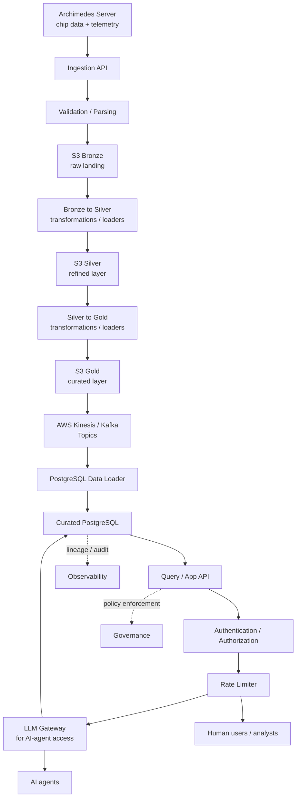

# Semiconductor Intelligence Platform (SIP)

A sovereign semiconductor intelligence platform for ingesting, governing, and analyzing manufacturing and engineering data. It combines metadata-driven ingestion, S3 lakehouse-style storage, PostgreSQL-backed intelligence, and AI-ready retrieval scaffolding.

## Start here

If you are new to this repository, read these in order:

1. [docs/developer-guide.md](docs/developer-guide.md) - end-to-end developer onboarding, setup, configuration, run, verification, source onboarding, and troubleshooting guide.
2. [docs/architecture.md](docs/architecture.md) - architecture notes explaining the metadata-driven design and platform components.
3. [docker-compose.yml](docker-compose.yml) - the local runtime stack.

## What this repository provides

- Multi-format ingestion for MES, ERP, equipment, PLM, telemetry, and yield payloads
- Metadata-driven validation and routing for new data sources
- S3-based raw landing and lakehouse-style asset cataloging
- Governance controls for IP-sensitive and restricted data
- Traceability links across lots, wafers, tools, and design versions
- AI/RAG-ready document indexing and search scaffolding

## Architecture at a glance

1. Source systems send events into the ingestion API.
2. The parser and validator normalize each payload and land it in the S3 raw bronze layer.
3. Transformation and loader jobs move data from bronze to silver and then from silver to gold.
4. The S3 gold layer publishes to AWS Kinesis / Kafka topics, and a data loader persists the curated operational records into PostgreSQL.
5. PostgreSQL-backed consumption is then exposed securely to governance, traceability, AI services, and human users.

### Secure AI and Human Consumption Reference Architecture

This reference view shows how Archimedes chip data and telemetry flow through S3 bronze, silver, and gold layers, then through AWS Kinesis / Kafka topics into PostgreSQL via a data loader before secure consumption by AI agents and human users.



Notes:
- PostgreSQL remains the trusted curated data store for downstream consumption.
- S3 is organized into bronze, silver, and gold lakehouse layers, with dedicated transformations and loaders between them.
- AWS Kinesis / Kafka topics are fed from the S3 gold layer, and PostgreSQL is loaded from those topics through a data-loader tier.
- Human users consume through the secured API layer.
- AI agents consume through the LLM gateway path when prompt governance, guardrails, and model routing are required.
- The rate limiter applies at the shared consumption edge to protect both human and agent-driven workloads.

## Quick start

```bash
git clone <this-repo>
cd Semiconductor_Operations_Data_Platform
docker compose up --build
```

Once the services are up, use the Swagger UI at `http://localhost:8000/docs` or call the ingestion endpoints directly.

## Key services

| Service | Purpose |
| --- | --- |
| FastAPI ingestion API | Accepts and routes new events |
| S3 landing zone | Stores raw payloads for lakehouse workflows |
| PostgreSQL | Stores curated records and audit information |
| Governance and AI layers | Applies policy rules and supports retrieval-based intelligence |

## Repository layout

| Folder | What it holds |
| --- | --- |
| `alembic/` | Database migration environment and revision history for schema evolution. |
| `common/` | Shared platform code such as AWS wrappers, repositories, governance, orchestration, AI helpers, models, and reusable services. |
| `config/` | Runtime configuration files for application settings, infrastructure endpoints, logging, and database connectivity. |
| `docs/` | Architecture notes, presentations, onboarding guides, and other project documentation. |
| `infrastructure/` | Container, LocalStack, and environment bootstrap assets used to run the platform locally or provision supporting services. |
| `ingestion-service/` | The FastAPI application entrypoints, API routes, and service wiring for ingestion workflows. |
| `metadata/` | Metadata-driven source definitions, routing, mappings, stream settings, and validation configuration that control ingestion behavior. |
| `sample-data/` | Example payloads and sample files for manual testing, demos, and validation scenarios. |
| `schemas/` | JSON schemas and related schema definitions used to validate incoming source payloads. |
| `scripts/` | Utility scripts for setup, test execution, data normalization, and operational workflows. |
| `tests/` | Automated tests covering API behavior, metadata validation, governance, and end-to-end platform flows. |

Use this layout as the default guide for placing new code:
- source onboarding and routing changes usually belong in `metadata/` and `schemas/`
- reusable logic should go under `common/`
- API-specific behavior should go under `ingestion-service/`
- operational helpers belong in `scripts/`
- documentation updates belong in `docs/` or `README.md`

## Test and validation

```powershell
./scripts/run_pytest.ps1 -q tests/test_api.py -k "validation_ui"
```

The repository includes sample payloads and smoke-test flows for telemetry, yield, and core ingestion paths.

## Documentation

- [docs/developer-guide.md](docs/developer-guide.md)
- [docs/architecture.md](docs/architecture.md)
- [docs/end_to_end_test_result.md](docs/end_to_end_test_result.md)

## Project owner

ravikanth.kowdeed@gmail.com
