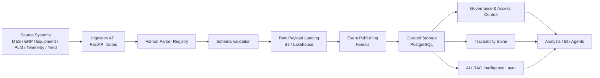
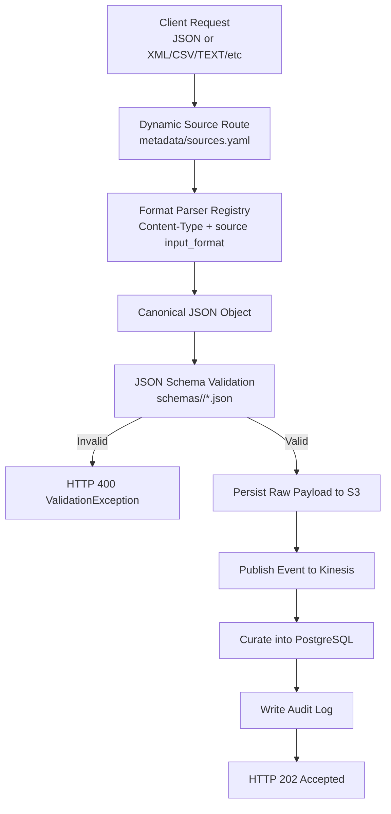
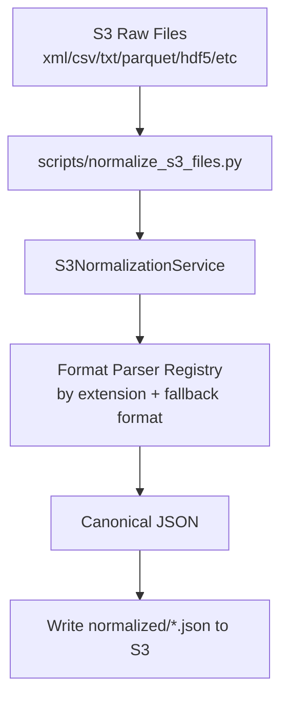
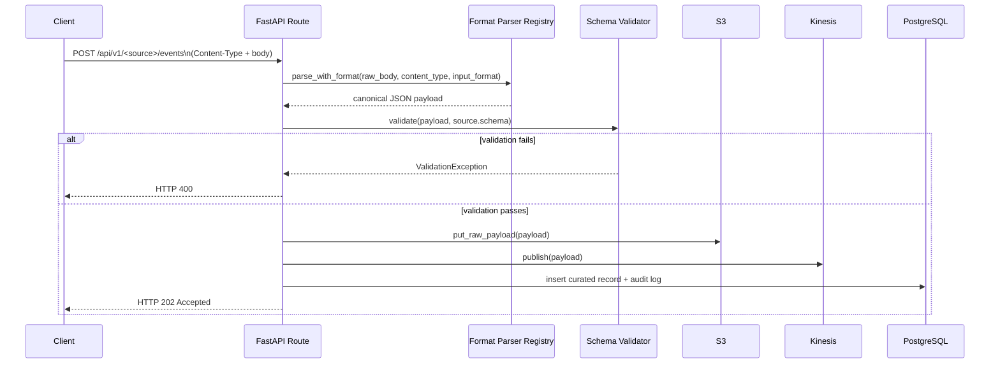

# Semiconductor_Operations_Data_Platform (SODP) — Phase 1

An AWS-native, **metadata-driven** data ingestion framework for semiconductor
manufacturing data. Phase 1 ingests MES (Manufacturing Execution System)
events, validates them against JSON Schema, lands the raw payload in S3,
publishes an event to Kinesis, and writes a curated record to PostgreSQL —
entirely on your local machine via Docker Compose + LocalStack.

Onboarding a new source is a **configuration change, not a code change**:
add an entry to `metadata/sources.yaml`, drop in a JSON Schema, and
(optionally) a field mapping — no new endpoint code required.

Project owner: ravikanth.kowdeed@gmail.com

---

## Source Systems in Semiconductor

This platform now supports multi-format ingestion for telemetry and yield data, access-controlled governance for IP-sensitive assets, S3 lakehouse-style metadata cataloging, and a lightweight AI intelligence scaffold for RAG-ready retrieval on top of PostgreSQL.

It ingests events from four common enterprise and factory systems:

- MES (Manufacturing Execution System): the real-time factory execution layer
      that tracks wafer lots, enforces route/recipe controls, and provides shop-floor
      traceability.
- Equipment systems (tool/gateway events): telemetry and status data from fab
      tools (for example, etch, deposition, lithography, metrology), including
      alarms, state changes, and process context.
- ERP (Enterprise Resource Planning): business operations data such as work
      orders, planning, inventory, procurement, and fulfillment alignment.
- PLM (Product Lifecycle Management): product definition and engineering change
      control, including part/BOM revisions and lifecycle state transitions.

Why this matters in semiconductor manufacturing:

- MES + Equipment improve yield and cycle-time by ensuring process execution
      discipline and fast detection of tool/process excursions.
- ERP links factory execution to demand, material availability, and financial
      outcomes.
- PLM ensures production uses the correct released product definitions and
      approved engineering changes.
- Together, these systems provide end-to-end operational traceability from
      engineering intent to production execution and business delivery.

---

## Architecture

### End-to-End Data Flow Diagram



### Runtime Data Flow (API Ingestion)



### Offline/Batch Data Flow (S3 File Normalization Worker)



### Sequence Diagram (Request Path)



## Technology Stack

| Layer            | Technology                              |
|-------------------|------------------------------------------|
| Language           | Python 3.12                              |
| API framework      | FastAPI + Uvicorn                        |
| Validation         | Pydantic v2, jsonschema                  |
| ORM / migrations   | SQLAlchemy 2.x, Alembic                  |
| Database           | PostgreSQL 16                            |
| Object storage     | Amazon S3 (via LocalStack)                |
| Streaming          | Amazon Kinesis (via LocalStack)           |
| AWS SDK            | Boto3                                    |
| Logging            | structlog (JSON)                         |
| Testing            | pytest, httpx, moto                      |
| Observability      | Prometheus, Grafana                      |
| Containerization   | Docker, Docker Compose                    |

## New Platform Capabilities

- Data ingestion: metadata-driven ingestion for JSON/CSV/XML/text and semiconductor telemetry/yield payloads.
- Governance: role-based access-control policies for restricted or proprietary data assets.
- Lakehouse: S3-backed cataloging with asset metadata for downstream analytics and BI workloads.
- AI intelligence: document indexing and semantic-style search scaffolding for future PostgreSQL + pgvector RAG applications.

## Repository Structure

```
Semiconductor_Operations_Data_Platform/
├── docker-compose.yml       # postgres, pgadmin, localstack, ingestion-service, prometheus, grafana
├── .env                      # local environment variables
├── requirements.txt
├── config/                   # application/aws/logging/database YAML config
├── metadata/                 # sources.yaml, mappings.yaml, routing.yaml, validation.yaml, streams.yaml
├── schemas/                  # per-source JSON Schemas
├── sample-data/               # example payloads for manual testing
├── infrastructure/
│   ├── localstack/init-aws.sh # S3 bucket + Kinesis stream bootstrap
│   ├── docker/Dockerfile
│   └── scripts/
├── scripts/
│   ├── sql/init.sql           # schema + table bootstrap
├── common/                   # shared library code (config, logger, exceptions,
│                              # models, validation, storage, aws, repository, utils)
├── ingestion-service/        # the FastAPI service
├── alembic/                  # optional migration-driven schema management
├── tests/                    # pytest suite (59 tests)
└── docs/
```

## Database Table Relationships

The PostgreSQL model currently uses **logical relationships** (lineage keys)
instead of SQL foreign key constraints.

### Tables and roles

- `mdm.lot_master`: curated MES records (one row per accepted MES event).
- `metadata.raw_events`: generic curated/landing table for non-MES sources
      (ERP, equipment, PLM) with the full source payload in `payload`.
- `metadata.ingestion_log`: audit table for every ingestion request attempt
      (success or failure), including request-level telemetry.

### Logical relationships

- One ingestion request produces exactly one `metadata.ingestion_log` row.
- A successful request produces one curated row:
      - MES -> `mdm.lot_master`
      - ERP/equipment/PLM -> `metadata.raw_events`
- Request lineage is correlated using:
      - `request_id` (API response + `metadata.ingestion_log.request_id`)
      - `source` (`metadata.ingestion_log.source` and `metadata.raw_events.source`)
      - `s3_key` (present in API response and `metadata.raw_events.s3_key`)

```mermaid
flowchart LR
      A[Ingestion Request]\n(source, request_id)
      B[metadata.ingestion_log]\n(request_id, source, status, stream)
      C[mdm.lot_master]\n(MES curated row)
      D[metadata.raw_events]\n(ERP/equipment/PLM curated row)

      A --> B
      A -->|source=mes| C
      A -->|source in erp/equipment/plm| D
```

### Note on constraints

- There are currently no FK constraints between these tables by design.
- If strict relational enforcement is needed later, add shared technical keys
      (for example a persisted `request_id` in curated tables) plus foreign keys.

### Lineage view

To make request-to-curated tracing easier, the bootstrap SQL creates
`metadata.v_ingestion_lineage`.

Example query:

```sql
SELECT request_id,
       source,
       curated_table,
       curated_record_id,
       curated_s3_key,
       ingested_at,
       curated_created_at
FROM metadata.v_ingestion_lineage
ORDER BY ingested_at DESC
LIMIT 20;
```

Run from the repo root:

```bash
docker compose exec -T postgres psql -U sap_user -d semiconductor -c "SELECT source, COUNT(*) AS lineage_row_count FROM metadata.v_ingestion_lineage GROUP BY source ORDER BY source;"
```

## Prerequisites

- Docker Engine + Docker Compose v2
- ~4 GB free RAM for the container set
- Ports free on the host: `5432, 5050, 4566, 8000, 9090, 3000`

## Quick Start

```bash
git clone <this-repo>
cd Semiconductor_Operations_Data_Platform
docker compose up --build
```

Startup takes roughly 30–60 seconds while Postgres initializes and
LocalStack provisions the S3 bucket and Kinesis streams.

Once healthy:

| Service           | URL                                      | Credentials                |
|--------------------|--------------------------------------------|------------------------------|
| Swagger UI          | http://localhost:8000/docs                  | —                             |
| Ingestion API        | http://localhost:8000/api/v1                | —                             |
| Health check         | http://localhost:8000/api/v1/health          | —                             |
| pgAdmin              | http://localhost:5050                        | admin@sap.local / admin       |
| LocalStack           | http://localhost:4566                        | —                             |
| Prometheus            | http://localhost:9090                        | —                             |
| Grafana                | http://localhost:3000                        | admin / admin                 |

## Sending a Test Event

```bash
curl -X POST http://localhost:8000/api/v1/mes/events \
  -H "Content-Type: application/json" \
  -d @sample-data/mes/lot_completed_sample.json

curl -X POST http://localhost:8000/api/v1/erp/events \
      -H "Content-Type: application/json" \
      -d @sample-data/erp/work_order_sample.json

curl -X POST http://localhost:8000/api/v1/equipment/events \
      -H "Content-Type: application/json" \
      -d @sample-data/equipment/equipment_event_sample.json

curl -X POST http://localhost:8000/api/v1/plm/events \
      -H "Content-Type: application/json" \
      -d @sample-data/plm/product_lifecycle_event_sample.json

curl -X POST http://localhost:8000/api/v1/telemetry/events \
      -H "Content-Type: application/json" \
      -d @sample-data/telemetry/telemetry_sample.json

curl -X POST http://localhost:8000/api/v1/yield/events \
      -H "Content-Type: text/csv" \
      -d @sample-data/yield/yield_sample.csv
```

## Mock-data validation

The repository includes sample payloads under [sample-data/telemetry](sample-data/telemetry) and [sample-data/yield](sample-data/yield) so you can validate the ingestion path locally with the built-in test harness or a running FastAPI service.

Expected response (`202 Accepted`):

```json
{
  "request_id": "…",
  "source": "mes",
  "status": "ACCEPTED",
  "s3_key": "mes/2026/07/15/mes-<request_id>.json",
  "stream": "mes-events",
  "sequence_number": "…",
  "curated_record_id": "…"
}
```

### Verifying each stage

```bash
# Raw payload landed in S3
awslocal --endpoint-url=http://localhost:4566 s3 ls s3://semiconductor-landing/mes/ --recursive

# Event published to Kinesis
awslocal --endpoint-url=http://localhost:4566 kinesis describe-stream --stream-name mes-events

# Curated record in PostgreSQL
docker exec -it sap-postgres psql -U sap_user -d semiconductor \
  -c "SELECT lot_id, recipe_id, equipment_id, wafer_count FROM mdm.lot_master ORDER BY created_at DESC LIMIT 5;"
```

(`awslocal` ships with LocalStack; alternatively use plain `aws --endpoint-url=http://localhost:4566 ...`.)

### Validation failure example

```bash
curl -X POST http://localhost:8000/api/v1/mes/events \
  -H "Content-Type: application/json" \
  -d @sample-data/mes/lot_completed_invalid_sample.json
```

Returns `400 Bad Request` with a structured list of schema violations.

## Onboarding a New Source (no code changes)

1. Add a JSON Schema under `schemas/<source>/<event>.json`.
2. Add an entry to `metadata/sources.yaml` with `enabled: true`.
3. (Optional) Add a field mapping to `metadata/mappings.yaml` if the source
   should populate a dedicated curated table; otherwise payloads land in the
   generic `metadata.raw_events` table automatically.
4. (Optional) Add a routing override to `metadata/routing.yaml`.
5. Restart the ingestion-service container — the new endpoint is registered
   automatically from metadata at startup.

## Running Tests

Tests run entirely offline (AWS mocked via `moto`, PostgreSQL simulated with
in-memory SQLite), so `docker compose up` is **not** required:

```bash
pip install -r requirements.txt --break-system-packages
pytest
```

59 tests cover: schema validation, the REST API (happy path + validation
failure + malformed JSON), the Repository Pattern, the Kinesis publisher, S3
upload, and the configuration loader.

To run the suite inside the running container instead:

```bash
docker compose exec ingestion-service pytest /app/tests
```

## Configuration

All runtime configuration lives in `.env` and `config/*.yaml`, with
`${VAR:default}` interpolation against environment variables. Key variables:

| Variable                | Purpose                                  | Default                     |
|--------------------------|--------------------------------------------|-------------------------------|
| `DATABASE_URL`             | SQLAlchemy connection string                | see `.env`                     |
| `AWS_ENDPOINT_URL`          | LocalStack endpoint                          | `http://localstack:4566`        |
| `S3_LANDING_BUCKET`          | Raw payload bucket                            | `semiconductor-landing`          |
| `KINESIS_MES_STREAM`          | Physical Kinesis stream for MES events          | `mes-events`                      |
| `LOG_LEVEL`                     | structlog / stdlib log level                     | `INFO`                              |

## Health & Observability

`GET /api/v1/health` aggregates the status of `database`, `localstack`,
`kinesis`, `s3`, and `application`, returning `503` if any component is
down. `GET /api/v1/ready` is a lightweight liveness/readiness probe for
container orchestrators.

Every request is logged as a single JSON line (via `structlog`) containing
`request_id`, `source`, `stream`, `timestamp`, `status`, and `duration`.

## Definition of Done

- [x] `docker compose up` brings up all six containers healthy
- [x] Swagger UI available at `/docs`
- [x] `POST /api/v1/mes/events` functional end-to-end
- [x] `POST /api/v1/erp/events` functional end-to-end
- [x] `POST /api/v1/equipment/events` functional end-to-end
- [x] `POST /api/v1/plm/events` functional end-to-end
- [x] Payload validation returns `400` on schema violations
- [x] Raw payload uploaded to the LocalStack S3 bucket
- [x] Event published to the `mes-events` Kinesis stream
- [x] Curated record persisted to PostgreSQL (`mdm.lot_master`)
- [x] Structured JSON logs + passing `/api/v1/health`
- [x] Full `pytest` suite passes (59/59)

## Future Compatibility

The metadata-driven design leaves room to add, without modifying the
ingestion framework itself: a Metadata Service, MDM Service, Data Quality
Service, Catalog Service, Semantic Layer, Knowledge Graph, and AI Agents —
each can subscribe to the existing Kinesis streams or read from the S3
landing zone / curated PostgreSQL tables.
