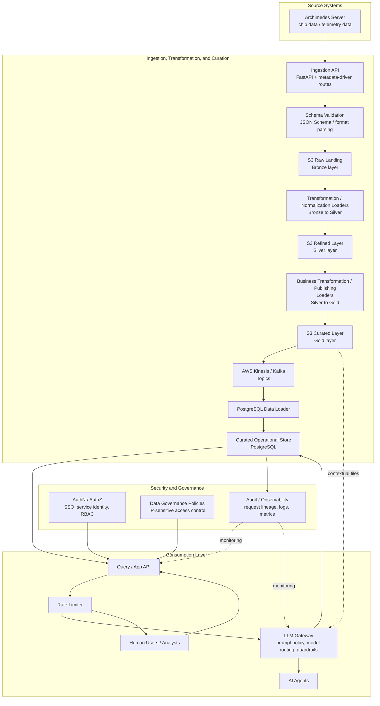

# Architecture Notes

## Design Principle: Metadata Over Code

Every source-specific decision (endpoint path, JSON Schema, target table,
Kinesis stream, S3 prefix) is externalized to YAML under `metadata/`. The
`MetadataRegistry` (`common/config/metadata_registry.py`) is the single
place that resolves this configuration at runtime. Application code —
routes, validators, publishers, storage, curation — is written once against
`MetadataRegistry` and never branches on source name.

## Request Lifecycle

1. `ingestion-service/api/routes.py` dynamically registers one POST route
   per enabled entry in `metadata/sources.yaml` at startup.
2. `services/ingestion_service.py` (`IngestionService.ingest`) orchestrates:
   parse → validate → persist-raw → publish → curate → audit-log.
3. Each step delegates to a metadata-aware service
   (`PayloadValidatorService`, `RawStorageService`, `EventPublisherService`,
   `CurationService`) that resolves source-specific behavior from the
   registry before calling the underlying AWS/DB wrapper.

## Repository Pattern

`common/repository/base.py` defines `BaseRepository`; concrete repositories
(`LotRepository`, `RawEventRepository`, `IngestionLogRepository`) live in
`common/repository/repositories.py` and are the only code that touches
SQLAlchemy sessions directly.

## AWS Wrapper Layer

All boto3 usage is isolated under `common/aws/`: `S3Client`,
`KinesisPublisher`, `SecretsManager`, `CloudWatchLogger`. No other module
imports `boto3` directly.

## Extensibility

Adding a new downstream capability (Data Quality Service, Catalog Service,
Knowledge Graph, AI Agents, etc.) means subscribing to the existing Kinesis
streams or reading the S3 landing zone / curated PostgreSQL tables — the
ingestion framework itself does not need to change.

## Governance, Lakehouse, Traceability, and AI Scaffolding

The repository now includes the core platform capabilities described in the AZITA technical design:

- Governance: [common/governance/governance_service.py](common/governance/governance_service.py) provides lightweight access-control policies for IP-sensitive assets.
- Lakehouse catalog: [common/storage/lakehouse_service.py](common/storage/lakehouse_service.py) tracks S3-backed assets and their metadata for downstream analytics.
- Traceability spine: [common/traceability/traceability_service.py](common/traceability/traceability_service.py) links lots, wafers, process steps, tools, and design versions.
- Agent orchestration: [common/orchestration/agent_service.py](common/orchestration/agent_service.py) tracks agent heartbeats and recovery signals.
- Intelligence: [common/ai/intelligence_service.py](common/ai/intelligence_service.py) provides an in-memory document index and search scaffold suitable for RAG-style retrieval.

These services are intentionally lightweight and can be backed by PostgreSQL, S3 manifests, and pgvector in a later phase without changing the ingestion API.

## Reference Diagram: Secure AI and Human Data Consumption

The following diagram shows the target reference architecture for Archimedes chip and telemetry data flowing through the S3 medallion layers (raw bronze, silver, gold), then from the S3 gold layer into AWS Kinesis / Kafka topics and onward into PostgreSQL through a data-loader tier. The LLM gateway and rate-limiting layers are shown as the recommended access path for agent-driven usage; the current repository provides the ingestion, governance, and AI scaffolding that this pattern can build on.

### Notes

- Archimedes-originated chip data and telemetry enter through the ingestion API, are validated, and first land in the S3 bronze layer.
- Transformation and loader stages promote data from bronze to silver and from silver to gold before downstream operational serving.
- The S3 gold layer is the publishing source for AWS Kinesis / Kafka topics, and PostgreSQL is loaded from those topics through a dedicated data-loader tier.
- Raw, refined, and curated S3 layers remain available for replay, lineage, traceability, and RAG/document enrichment scenarios.
- Human access should terminate at the application/query API, protected by authentication, authorization, and audit logging.
- AI-agent access should preferably traverse a rate limiter and LLM gateway so prompts, tool calls, quotas, and model routing can be centrally governed.
- In the current codebase, governance and AI scaffolding already exist in [governance_service.py](C:/Users/ravik/rkpy/Semiconductor_Intelligence_Platform.worktrees/architecture-diagram-ai-data-flow/common/governance/governance_service.py), [agent_service.py](C:/Users/ravik/rkpy/Semiconductor_Intelligence_Platform.worktrees/architecture-diagram-ai-data-flow/common/orchestration/agent_service.py), and [intelligence_service.py](C:/Users/ravik/rkpy/Semiconductor_Intelligence_Platform.worktrees/architecture-diagram-ai-data-flow/common/ai/intelligence_service.py); the LLM gateway and rate-limiter are represented here as the recommended integration pattern.
